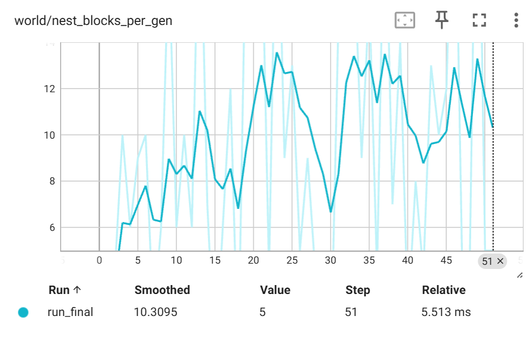
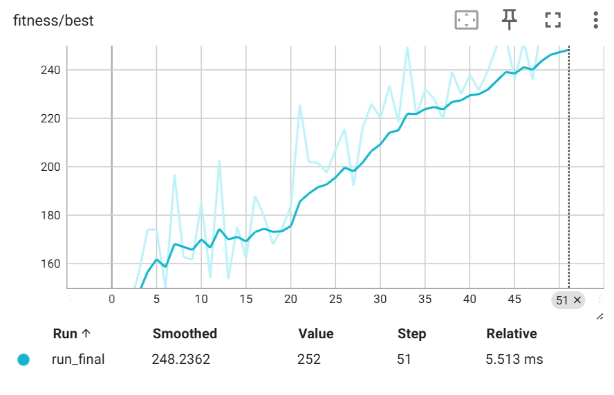
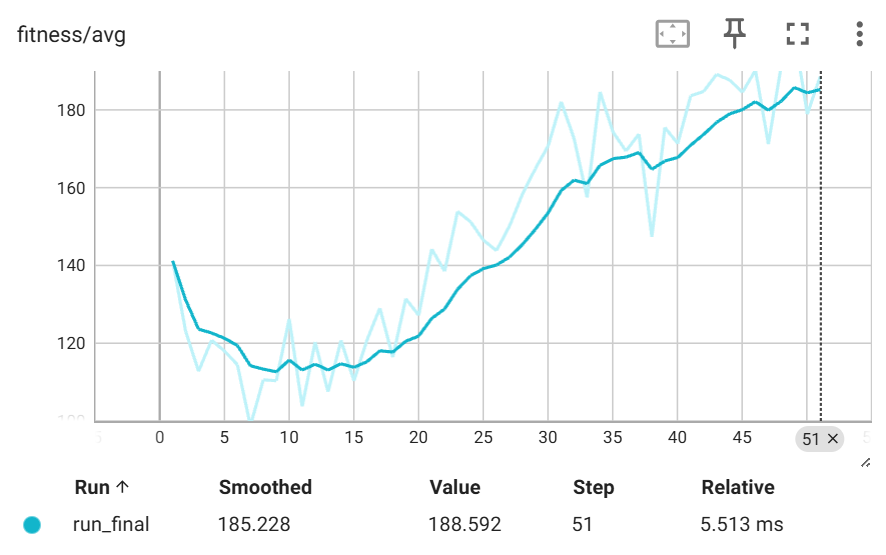
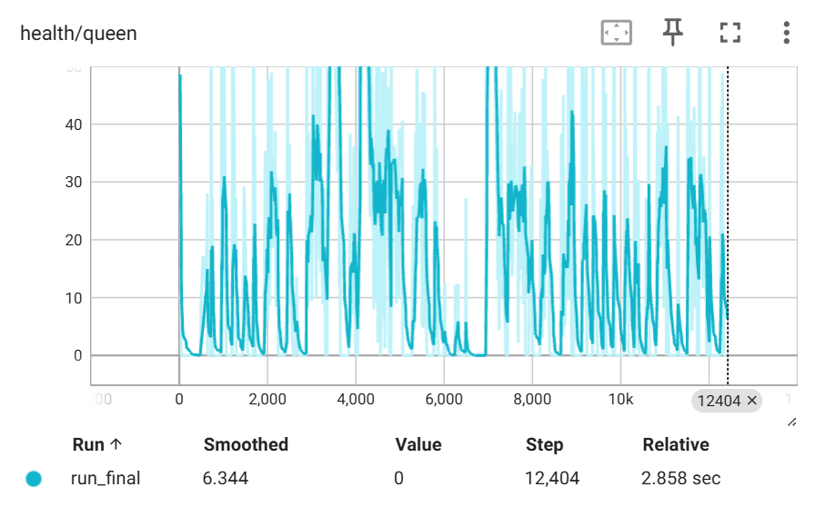
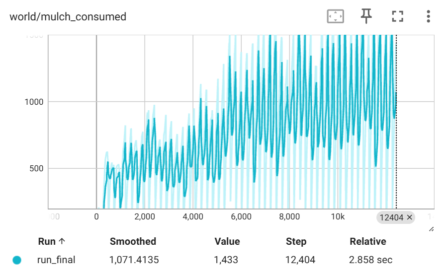
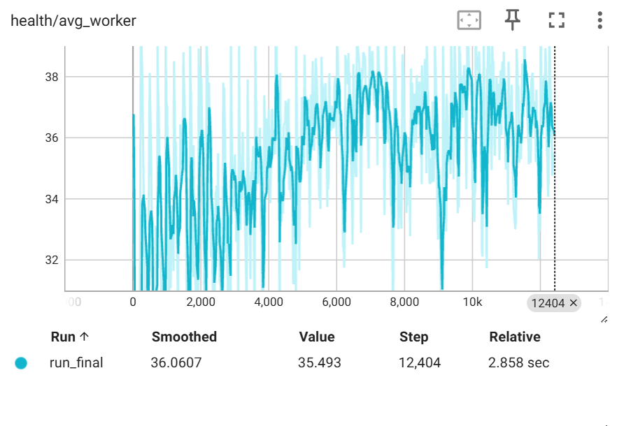
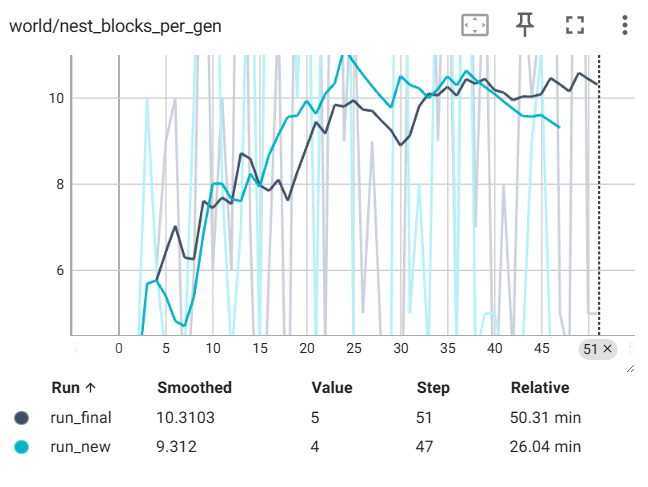
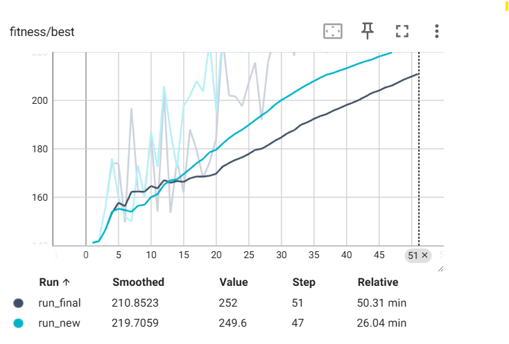
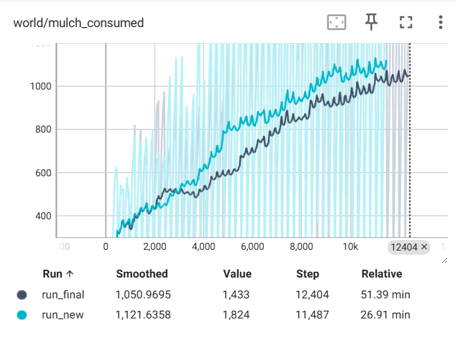
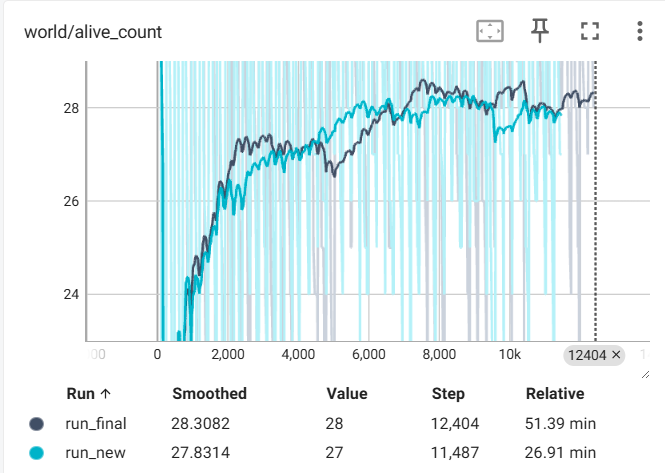

# Antymology: Evolutionary Ant Colony

## Project Overview

Antymology is a voxel-based simulation where a colony of ants evolves simple behaviors to build the largest nest possible. The world is procedurally generated, ants must obey terrain and health constraints, and a singular queen converts her health into nest blocks. Each generation evaluates performance and breeds a new population with mutation, creating visible improvement over time.

## Demo Media


### Video


Full-resolution MP4: [Images/Results/Speed Run Video of Assignment 3.mp4](Images/Results/Speed%20Run%20Video%20of%20Assignment%203.mp4)

> **Note:**
>
> - **Ants:**
>   - The **queen ant** is colored yellow.
>   - **Worker ants** are colored brownish orange.
> - **Block types:**
>   - **Acidic block:** Purple
>   - **Mulch block:** Dark green
>   - **Nest block:** Red
>   - **Stone block:** Medium light grey
>   - **Container block:**: Light grey
>   - **Grass block:** Light Green

## Getting Started

### How To Run

1. Open the project in Unity 6000.3.\* and load SampleScene.
2. Press Play.
3. Watch the HUD for generation, time remaining, living ants, and nest blocks.

#### (Optional) Stream Simulation Metrics to TensorBoard

You can visualize simulation metrics (health, fitness, nest blocks, etc.) in real time using TensorBoard:

1. **Run the simulation**

- Start the Unity scene. Metrics are written to a per-run folder under the Unity persistent data path:
  `C:\Users\<YourUsername>\AppData\LocalLow\DefaultCompany\Antymology\metrics\run_YYYYMMDD_HHMMSS`
- You should see files like `health_metrics.csv` and `generation_metrics.csv`.

2. **Stream metrics into TensorBoard**

- In a terminal, run one of the following commands (replace `<YourUsername>` with your Windows username):

**Option A: Stream a specific run folder**

```bash
python "tools/tensorboard_log.py" --metrics-dir "C:\Users\<YourUsername>\AppData\LocalLow\DefaultCompany\Antymology\metrics\run_YYYYMMDD_HHMMSS" --logdir "tb_logs/<run-name>" --follow
```

You can name `<run-name>` anything you like (e.g., run1, run2, experimentA).

**Option B: Stream all runs**

```bash
python tools/tensorboard_log.py --metrics-dir "C:\Users\<YourUsername>\AppData\LocalLow\DefaultCompany\Antymology\metrics" --logdir "tb_logs/<run-name>" --follow
```

3. **Launch TensorBoard**

- In another terminal:

```bash
tensorboard --logdir tb_logs
```

- Then open: http://localhost:6006/

### Controls

- Fly camera: `WASD` to move, `Q/E` to move vertically.
- Rotate camera: middle mouse button + drag.

## Ant Behavior & Rules

- Health decreases every tick; ants die at 0 health and are removed.
- Mulch is consumed only when an ant is directly above it, and only if no other ant shares the cell.
- Ants may dig the block below them (never container blocks) and move into the dug space.
- Movement is limited to a maximum height difference of 2 between positions.
- Acidic blocks double the health drain rate.
- Ants may share health with another ant in the same cell (zero-sum transfer).
- A single queen builds nest blocks at the cost of 1/3 her max health.

### Evolutionary Algorithm

Each worker ant has a weighted genome that biases movement, digging, consuming, and sharing. At the end of each generation:

1. Workers are ranked by fitness (health + mulch consumed).
2. The top performers are kept as elites.
3. New genomes are created by crossover and mutation.
   This creates simple but observable evolutionary improvement without hand-authored behavior scripts.

## Configuration

The simulation is tuned using parameters in [Assets/Components/Configuration/ConfigurationManager.cs](Assets/Components/Configuration/ConfigurationManager.cs). Here are the current key settings and what they mean:

| Parameter                     | Value | Meaning                                    |
| ----------------------------- | ----- | ------------------------------------------ |
| `Seed`                        | 1337  | World generation seed (randomness control) |
| `World_Diameter`              | 16    | Number of chunks in X/Z (world size)       |
| `World_Height`                | 4     | Number of chunks in Y (vertical size)      |
| `Chunk_Diameter`              | 8     | Blocks per chunk edge                      |
| `Number_Of_Acidic_Regions`    | 10    | Acidic region count (hazardous areas)      |
| `Acidic_Region_Radius`        | 5     | Acidic region size                         |
| `Number_Of_Conatiner_Spheres` | 5     | Container region count (blue blocks)       |
| `Conatiner_Sphere_Radius`     | 20    | Container region size                      |
| `WorkerCount`                 | 30    | Number of worker ants per generation       |
| `WorkerMaxHealth`             | 40    | Max health for workers                     |
| `QueenMaxHealth`              | 120   | Max health for queen                       |
| `HealthDrainPerTick`          | 0.4   | Health lost per tick                       |
| `MulchHealthGain`             | 15    | Health gained from mulch                   |
| `TickInterval`                | 0.25  | Seconds per simulation tick                |
| `EvaluationDuration`          | 60    | Seconds per generation                     |
| `EliteCount`                  | 12    | Number of elite genomes kept               |
| `MutationRate`                | 0.15  | Probability of genome mutation             |
| `MutationMagnitude`           | 0.4   | Max mutation change per gene               |
| `HealthShareAmount`           | 2     | Health shared per tick (if ants overlap)   |
| `MulchFitnessBonus`           | 2     | Fitness bonus per mulch consumed           |
| `NestFitnessBonus`            | 12    | Fitness bonus per nest block built         |
| `PheromoneDeposit`            | 0.2   | Pheromone deposited per tick               |
| `PheromoneMax`                | 2.5   | Max pheromone per cell                     |
| `PheromoneDecay`              | 0.05  | Pheromone lost per tick                    |
| `PheromoneBias`               | 1.2   | Strength of pheromone influence            |
| `GraphHistoryLength`          | 50    | HUD graph history length                   |
| `EnableCsvMetrics`            | true  | Write metrics for TensorBoard              |
| `MetricsSampleInterval`       | 1     | How often to log metrics (ticks)           |

These parameters control world size, ant health, evolutionary algorithm, pheromone logic, and logging. Adjusting them changes the simulation's difficulty, evolutionary pressure, and how ants interact with the environment.

## Results & Analysis

### Graphs (TensorBoard Exports)

> **Note:** In the graph below, `run_final` shows results **without** diffusion logic, and `run_new` shows results **with** diffusion logic implemented.
> 
> 
> 
> 
> 
> 

### Diffusion Results (Pheromone Diffusion)

> 
> 
> 
> 
> 

### Diffusion Analysis

**Clarification:**

- `run_final` refers to results from the simulation **without** the diffusion logic implemented.
- `run_new` refers to results from the simulation **with** the diffusion logic implemented.

After adding pheromone diffusion logic (`run_new`), the fitness level increased more rapidly and mulch consumption also rose. However, this change did not significantly impact the number of nest blocks per generation. This is likely due to the randomness of the queen's spawn location—if the queen is placed on an acidic or container block, she may die quickly, limiting nest block growth regardless of improved worker behavior.

## Technical Details

### Fitness Calculation

Fitness is used to rank ants at the end of each generation. For workers, fitness is:
fitness = health + (mulch consumed × 2)
For the queen, fitness is:
fitness = health + (mulch consumed × 2) + (nest built × 12)
This incentivizes nest building and mulch consumption. The calculation is implemented in [AntAgent.cs](Assets/Components/Agents/AntAgent.cs#L302-L307) and [ConfigurationManager.cs](Assets/Components/Configuration/ConfigurationManager.cs#L109-L116).

### Genome and Evolution

Each worker ant has a genome consisting of weights for movement, digging, consuming, and sharing. These weights bias the ant's actions. At the end of each generation:

- Ants are ranked by fitness.
- The top N are kept as elites (no mutation).
- The rest are generated by crossover (randomly mixing parent genomes) and mutation (randomly perturbing weights).
  Mutation rate and magnitude are configurable in [ConfigurationManager.cs](Assets/Components/Configuration/ConfigurationManager.cs).

### Movement and Pheromone Bias

Ants choose their next move based on genome weights and local pheromone concentration. The movement weight is scaled:
w' = w × (1 + p × 1.2)
Where w is the genome weight, p is the pheromone value. Queens follow nest pheromone, workers follow food pheromone. See [AntAgent.cs](Assets/Components/Agents/AntAgent.cs#L245-L255).
Movement is restricted to a max height difference of 2 between positions. Terrain constraints are checked in [CustomMath.cs](Assets/Helpers/CustomMath.cs).

### Pheromone Logic and Diffusion

Ants deposit pheromone each tick (up to 2.5 per cell). Air blocks decay pheromone by 0.05 per tick. Diffusion is implemented by blending each cell's pheromone with its neighbors, creating gradients ants can follow. This is handled in [AirBlock.cs](Assets/Components/Terrain/Blocks/AirBlock.cs#L81-L100).
Pheromone types:

- Food pheromone: guides workers to mulch.
- Nest pheromone: guides queen to build nest blocks.

### Health and Mulch

Health drains every tick. Mulch restores health when consumed. Acidic blocks double the health drain rate. Mulch can only be consumed if no other ant shares the cell. Health transfer between ants is zero-sum and only possible if they share a cell.

### Queen Logic

There is only one queen per generation. She builds nest blocks at the cost of 1/3 her max health. If her health reaches zero, she dies and cannot build further. Queen logic is implemented in [AntAgent.cs](Assets/Components/Agents/AntAgent.cs).

### Block and Ant Colors

This project uses both block and ant colors to visually distinguish different elements in the simulation.

#### Block Colors

Each block type—stone, grass, mulch, acidic, nest, and container—has its color defined by a specific tile in the texture atlas: [tilesheet.png](Assets/Resources/tilesheet.png).

**How it works:**

- Each block script (see links below) assigns a `tileMapCoordinate` to the block type.
- When rendering the world, the mesh UVs are set to sample the correct tile from the atlas based on this coordinate (see [Chunk.cs](Assets/Components/Terrain/Chunk.cs)).
- The actual color you see in-game comes from the artwork in `tilesheet.png`, not from code.

Relevant block scripts:

- [StoneBlock.cs](Assets/Components/Terrain/Blocks/StoneBlock.cs#L13-L31)
- [GrassBlock.cs](Assets/Components/Terrain/Blocks/GrassBlock.cs#L13-L31)
- [MulchBlock.cs](Assets/Components/Terrain/Blocks/MulchBlock.cs#L13-L31)
- [AcidicBlock.cs](Assets/Components/Terrain/Blocks/AcidicBlock.cs#L13-L31)
- [NestBlock.cs](Assets/Components/Terrain/Blocks/NestBlock.cs#L13-L31)
- [ContainerBlock.cs](Assets/Components/Terrain/Blocks/ContainerBlock.cs#L10-L31)

#### Ant Colors

Ant colors are set in code when ants are initialized:

- The queen ant is colored yellow: `new Color(0.95f, 0.82f, 0.2f)`.
- Worker ants are colored brown: `new Color(0.62f, 0.34f, 0.1f)`.
  This is handled in [AntAgent.cs](Assets/Components/Agents/AntAgent.cs), where the renderer's material color is set based on the ant's role.

### Procedural Terrain Generation

The world is generated procedurally using noise functions. Terrain generation and block placement are handled in [NoiseGenerator.cs](Assets/Helpers/NoiseGenerator.cs). Terrain constraints (height, block types) are enforced during ant movement and digging.

### Simulation Timing and Evaluation

Simulation runs in ticks, controlled by `TickInterval` and `EvaluationDuration` in [ConfigurationManager.cs](Assets/Components/Configuration/ConfigurationManager.cs). At the end of each evaluation, ants are ranked, and the next generation is bred.

### Data Logging and TensorBoard

Simulation metrics (health, fitness, nest blocks, etc.) are logged to CSV files. The helper script [tensorboard_log.py](tools/tensorboard_log.py) streams these metrics into TensorBoard for visualization. Metrics are written to per-run folders under the Unity persistent data path.

### UI and Controls

The HUD displays generation, time remaining, living ants, and nest blocks. Camera controls are implemented for fly and rotate modes. UI logic is handled in [UI](Assets/Components/UI).
